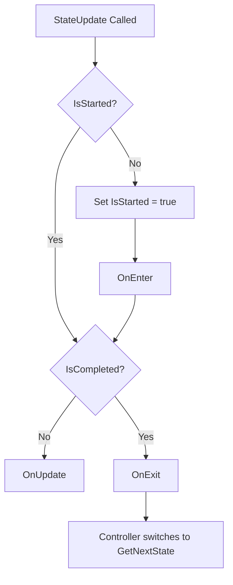

# StateMachine 有限狀態機模式

有限狀態機（FSM）是用來管理系統狀態轉移的經典模式，每個時刻系統僅會處於一種狀態。

## 核心介面與類別

### 控制器（Controllers）
- `StateController`：標準的狀態機控制器，管理一個當前狀態。在 `StateUpdate()` 中驅動當前狀態的生命週期，並在當前狀態標記為完成（`IsCompleted == true`）時，自動切換至 `GetNextState()` 所返回的下一個狀態。

### 狀態（States）
1. `IState` & `IStateController`：定義在 `IState.cs` 中，為狀態機運作的核心介面。
2. `State`：整合了繼承與事件驅動（Event-driven）雙重模式的具體 C# 類別。
   - **繼承用法**：可作為自訂狀態的基底類別，透過 `override` 生命週期方法（`OnEnter`、`OnUpdate`、`OnExit`）來實作邏輯。
   - **事件用法**：可直接 `new State()` 實例化，並透過訂閱 `OnStateEnter`、`OnStateUpdate`、`OnStateExit` 事件與呼叫 `SetNextStateFunction` 來動態組合狀態行為，無需額外宣告類別。
3. `ScriptableState`：繼承自 `ScriptableObject` 的狀態基底類別，適用於需要在 Unity Inspector 中配置參數的狀態設計（不支援動態事件，以保持純粹性）。

---

## 生命週期流程圖

當控制器驅動狀態更新（呼叫 `StateUpdate()`）時，狀態的執行流程如下：



---

## 使用範例

### 1. 使用繼承模式的 `State`

```csharp
using UnityEngine;
using DouduckLib;

public class CustomPatrolState : State
{
    float _patrolSpeed = 5f;

    protected override void OnEnter() 
    {
        Debug.Log("開始巡邏");
    }

    protected override void OnUpdate()
    {
        // 巡邏移動邏輯...
        if (/* 發現敵人 */ true)
        {
            Complete(); // 標記此狀態完成
        }
    }

    protected override void OnExit() 
    {
        Debug.Log("結束巡邏");
    }

    public override IState GetNextState()
    {
        // 返回下一個要切換的狀態
        return new CustomChaseState();
    }
}
```

### 2. 使用事件驅動（Event-Driven）的 `State`

適用於不需要特別宣告類別的快速開發或流程控制情境：

```csharp
using UnityEngine;
using DouduckLib;

public class GameFlowController : MonoBehaviour
{
    StateController _flowController;

    void Start()
    {
        var firstState = new State();
        var secondState = new State();

        // 訂閱事件
        firstState.OnStateEnter += state => Debug.Log("進入狀態一");
        firstState.OnStateUpdate += state =>
        {
            if (/* 滿足條件 */ true)
            {
                state.SetComplete();
            }
        };
        
        // 設定下一個狀態轉換（可返回任何 IState）
        firstState.SetNextStateFunction(state => secondState);

        secondState.OnStateEnter += state => Debug.Log("進入狀態二");

        _flowController = new StateController(firstState);
    }

    void Update()
    {
        _flowController.StateUpdate();
    }
}
```

### 3. 使用 `ScriptableState`（配置式狀態）

適合建立可重複使用的配置檔（Asset），並在 Inspector 中調整參數：

```csharp
using UnityEngine;
using DouduckLib;

[CreateAssetMenu(menuName = "AI/States/Patrol")]
public class ScriptablePatrolState : ScriptableState
{
    [SerializeField] float _speed = 3.5f;
    [SerializeField] ScriptableState _nextStateAsset;

    protected override void OnEnter() { }
    protected override void OnUpdate()
    {
        // 使用 _speed 進行巡邏
        if (/* 條件滿足 */ true)
        {
            Complete();
        }
    }

    public override IState GetNextState()
    {
        return _nextStateAsset;
    }
}
```

---

## 生命週期時序與特徵

- **即時退出**：在 `StateUpdate()` 中，如果在 `OnEnter()` 或 `OnUpdate()` 中呼叫了 `Complete()`，`OnExit()` 會在**同一次 `StateUpdate()` 調用中立即執行**。
- **跨 Frame 進入**：當狀態判定為 `IsCompleted == true` 並執行 `OnExit()` 後，控制器會在當下呼叫 `SetState(GetNextState())` 以切換狀態。新狀態的 `Initialize()` 會在當下執行，但新狀態的 `OnEnter()` 會在**下一個 Frame**（下一次呼叫控制器的 `StateUpdate()` 時）才執行。
