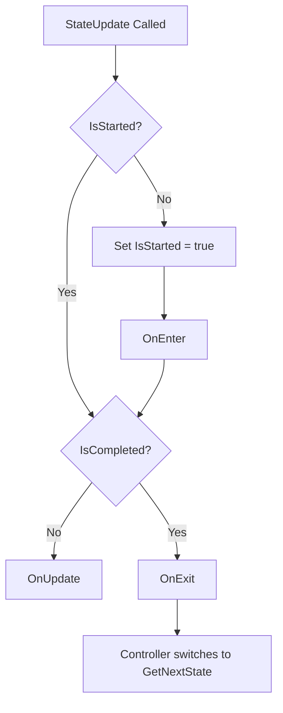

# StateMachine 有限狀態機模式

有限狀態機（FSM）是用來管理系統狀態轉移的經典模式，每個時刻系統僅會處於一種狀態。

## 核心介面與類別

### 控制器（Controllers）
- `StateController`：標準的狀態機控制器。管理一個當前狀態。在 `StateUpdate()` 中驅動當前狀態的生命週期，並在當前狀態標記為完成（`IsCompleted == true`）時，自動切換至 `GetNextState()` 所返回的下一個狀態。

### 狀態基底類別（States）
1. `StateBase`
   - 純 C# 類別的狀態抽象基底類別。
   - 封裝了狀態的生命週期：`OnEnter()` -> `OnUpdate()` -> `OnExit()`。
   - 透過呼叫 `Complete()` 標記此狀態完成，以通知控制器進行狀態轉移。
2. `ComponentState`
   - 繼承自 `MonoBehaviour` 的狀態基底類別，實作 `IState`。
3. `EventDrivenState`
   - 事件驅動型狀態，繼承自 `StateBase`。
   - **無需自訂子類**，可以直接透過事件訂閱（`OnStateEnter`, `OnStateUpdate`, `OnStateExit`）與設定下一個狀態委派函式（`SetNextStateFunction`）來定義狀態。

## 生命週期流程圖

當控制器驅動狀態更新（呼叫 `StateUpdate()`）時，狀態的執行流程如下：



## 使用範例

### 1. 使用 `StateController` 與自訂 `StateBase`

```csharp
using UnityEngine;
using DouduckLib;

public class SomeClass : MonoBehaviour
{
    StateController _stateController;

    void Start()
    {
        _stateController = new StateController(new SomeState(this));
    }

    void Update()
    {
        _stateController.StateUpdate();
    }
}

public class SomeState : StateBase
{
    SomeClass _owner;

    public SomeState(SomeClass owner) => _owner = owner;

    protected override void OnEnter() { }

    protected override void OnUpdate()
    {
        // 滿足特定條件時標記完成
        Complete();
    }

    protected override void OnExit() { }

    public override IState GetNextState()
    {
        return new AnotherState(_owner);
    }
}

public class AnotherState : StateBase
{
    SomeClass _owner;
    public AnotherState(SomeClass owner) => _owner = owner;

    public override IState GetNextState() => null;
}
```

### 2. 使用 `EventDrivenState` 

適用於不需要特別宣告類別的快速開發情境：

```csharp
using UnityEngine;
using DouduckLib;

public class AnotherClass : MonoBehaviour
{
    StateController _flowController;

    void Start()
    {
        var firstState = new EventDrivenState();
        var secondState = new EventDrivenState();

        firstState.OnStateEnter += state => { /* 進入邏輯 */ };
        firstState.OnStateUpdate += state =>
        {
            if (/* 滿足條件 */ true)
            {
                state.SetComplete();
            }
        };
        firstState.SetNextStateFunction(state => secondState);

        secondState.OnStateEnter += state => { /* 進入邏輯 */ };

        _flowController = new StateController(firstState);
    }

    void Update()
    {
        _flowController.StateUpdate();
    }
}
```

## 常用 API 說明

### `IStateController`

| 方法名稱 | 說明 |
| :--- | :--- |
| `SetState(IState state)` | 立即將當前狀態切換為 `state`。 |
| `StateUpdate()` | 驅動當前狀態更新，並在完成時自動執行狀態轉移。 |

### `IState` 與 `StateBase`

| 方法名稱 / 屬性 | 說明 |
| :--- | :--- |
| `Complete()` | *(保護方法)* 標記狀態為已完成（`IsCompleted = true`）。 |
| `GetNextState()` | *(抽象方法)* 定義並返回此狀態完成後所要切換的下一個狀態。 |
| `IsStarted` | *(屬性)* 是否已開始執行（已觸發 `OnEnter`）。 |
| `IsCompleted` | *(屬性)* 是否已完成執行（將會觸發 `OnExit`）。 |
